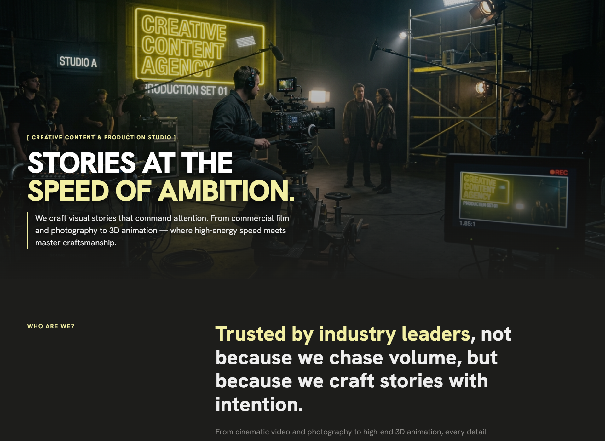
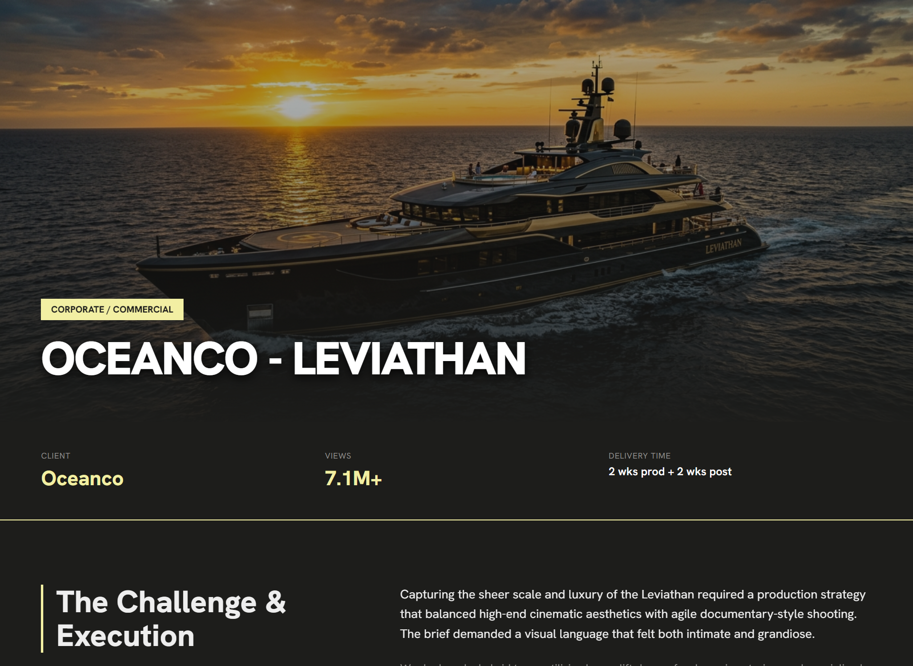

# Cinema Studio

Portfolio website for Cinema Studio, a creative content and production studio specializing in commercial video, brand photography, and 3D animation.

Built with Vite, Vanilla JavaScript, and custom CSS.

## Preview





## Features

- **Bento Grid Portfolio**: Showcase projects with interactive category filtering.
- **Project Showcase & Lightbox**: Detailed project pages with frame gallery lightbox preview.
- **Smart Navbar**: Auto-hides on scroll down and reveals on scroll up (stays hidden during hero section).
- **Light / Dark Mode**: Theme toggle with preference persisted in localStorage.
- **Responsive Layout**: Mobile drawer menu and single-column responsive fallbacks.

## Tech Stack

- **Framework**: None (Vanilla HTML5 / JS Modules)
- **Styling**: Custom CSS3 (Vanilla CSS variables)
- **Bundler**: Vite

## Project Structure

```
├── index.html                  # Main landing page
├── project-oceanco.html        # Project detail page
├── project-lafuente.html       # Project detail page
├── project-broederliefde.html  # Project detail page
├── src/
│   ├── main.js                 # App logic & event handlers
│   └── styles.css              # Global styles & design system
├── public/                     # Static media, favicon & screenshots
├── vite.config.js              # Vite configuration
└── package.json
```

## Getting Started

### Prerequisites

- Node.js (v18+ recommended)
- npm or pnpm

### Installation

```bash
npm install
```

### Development

Run local development server:

```bash
npm run dev
```

### Production Build

Build for production:

```bash
npm run build
```

Preview production build locally:

```bash
npm run preview
```
